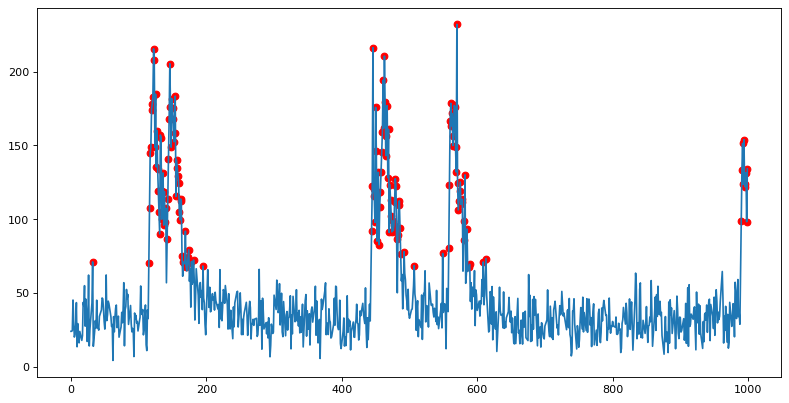
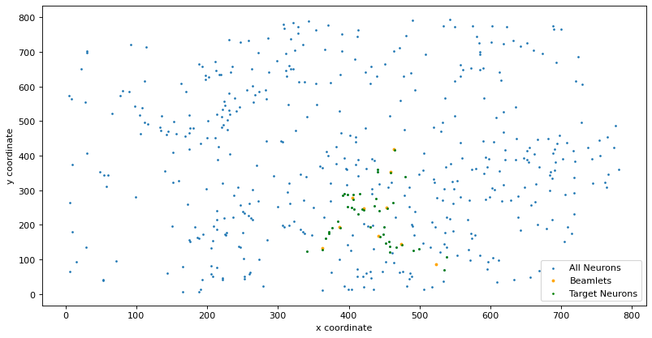
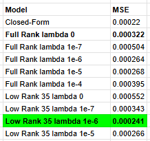
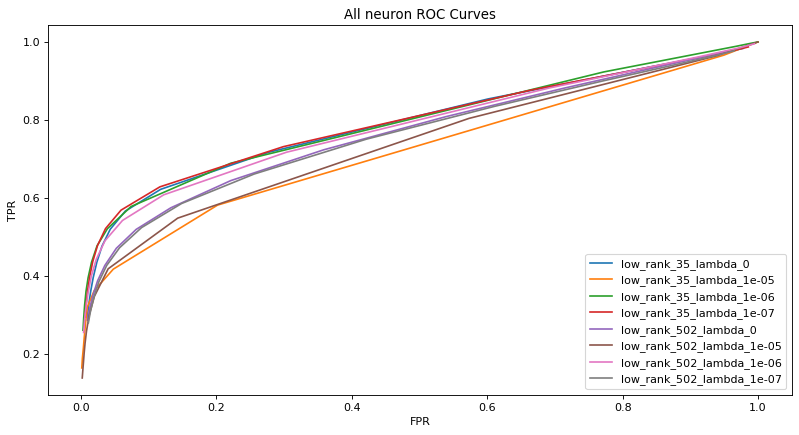
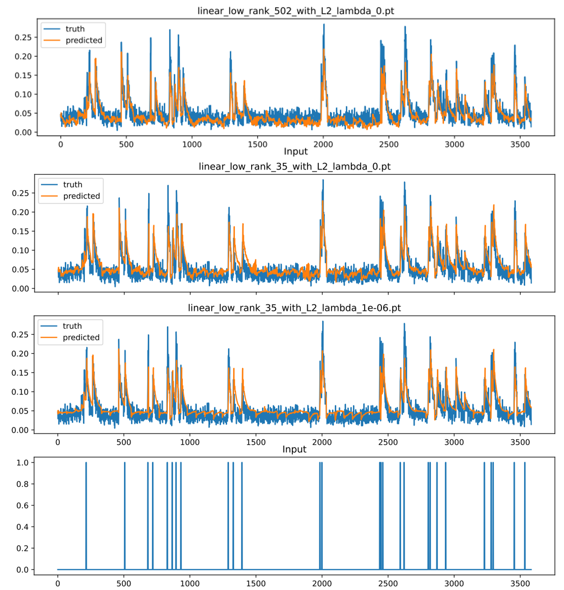

#  Regularization, Hyperparameter Tuning of Low Rank Autoregressive Models


### Environment Setup and Data Download

To begin on your own machine, clone this repository locally
```bash
git clone https://github.com/andrewjjeon/lowrank.git
```
Install requirements:
```bash
$ conda create -n lowrank python=3.8 -y
$ conda activate lowrank
$ pip install -r requirements.txt
$ cd lowrank
```

After environment setup,
- Download public `BCI_xx_xxxxxx.npy` data from [Google Drive Allen Institute BCI Data Download](https://drive.google.com/drive/folders/1Mwn6Gj_9edRmHYLE-RGdTRwET__HUhgc?usp=sharing).
- Work through `aj_models/BCI_data_processing_aj.ipynb` to process the raw `BCI_xx_xxxxxx.npy` we just downloaded. This notebook will generated a `sample_photostim_xx_spatial_date_xxxxxx.npy` containing our neural photostimulation spike response data.
- Work through `aj_models/low_rank_ark_model_aj.ipynb` to visualize the data, train the model, and tune the model to your liking.

### Low Rank Autoregressive Model Regularization and Hyperparameter Tuning

I conducted Regularization and Hyperparameter Tuning Experiments on the Low Rank Autoregressive Models used in this paper:
[<b>Active Learning of Neural Population Dynamics using two-photon holographic optogenetics</b>](https://arxiv.org/abs/2412.02529)

Some motivation for why is that there is a strong need for techniques that minimize the amount of data needed to learn neural population dynamics due to experimental time and resource constraints. The long-term goal that the above paper is working towards is for a model to be able to actively learn the patterns of neurons that have the most informative neural responses to quickly learn the neural population dynamics (brain activity).

This project used experimental data where a region of a mice brain was photostimulated with a laser. Specifically, patterns of neurons were photostimulated and the rest of region neuron's response (spikes) to that stimulation was recorded. 


<p>Spikes were determined as signal responses that were 6x greater than the baseline noise of the signal.</p>


<p>Here you can see an example pattern of neurons being photostimulated by the neuron.</p>

The project’s active learning technique takes advantage of the low-rank structure of the neural population dynamics to determine the most informative photostimulation patterns. It uses SVD to create low rank autoregressive models that predict neural activity (spikes). These are the models I experimented on. I tuned hyperparameters such as Lambda (L2 Regularization strength), Epochs, Learning Rate, Weight Initialization, k (number of autoregressive time steps used) with cross-validation loops. My best model resulted in a 25% improvement in performance (MSE) over the baselines the team had before I came on.
<div style="text-align:center">
  
  
</div>



<p>A comparison of the spike predictions of the closed-form, full-rank model, and low-rank model.</p>